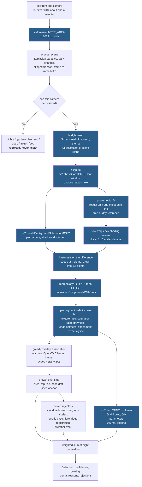
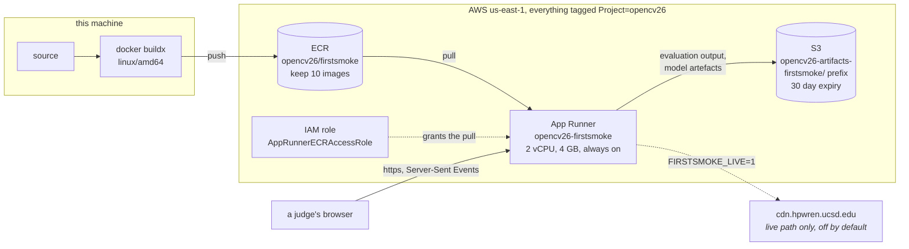

# Architecture

Three diagrams: the vision pipeline, the agent loop, and the AWS components.

## 1. The vision pipeline, one camera, one frame

Everything in the shaded path is OpenCV 5. The frame enters at the working width
of 1024 px and leaves as a list of measured regions, not as a verdict.

The one thing worth reading twice is the split between `MEASURE` and `GROWTH`.
Nothing in the single-frame measurements can separate smoke from cloud; they are
both grey, both soft-edged, both desaturating. The separation happens in
`GROWTH`, over minutes, and that is why this is a lookout rather than a
classifier.

## 2. The agent loop

The arrow that makes this an agent is `bearing → which cameras to read next`.
Different pixels select different cameras. Nothing in the loop is a fixed list.

```mermaid
stateDiagram-v2
  [*] --> WATCH
  WATCH --> SUSPECT: a camera scores above 0.35
  SUSPECT --> SUSPECT: re-read its own recent frames<br/>with the background model frozen
  SUSPECT --> WATCH: fewer than 4 frames of history,<br/>or the candidate faded
  SUSPECT --> CONSULT: pixel column becomes a bearing;<br/>geometry names the cameras that overlook it
  CONSULT --> CONSULT: read a neighbour, look only<br/>within 6 degrees of the predicted bearing
  CONSULT --> CONFIRMED: two or more bearings that cross<br/>in front of both cameras
  CONSULT --> STOOD_DOWN: neighbours clear on that bearing
  CONSULT --> NEEDS_HUMAN: neighbours blind, or still<br/>unresolved after three rounds
  STOOD_DOWN --> WATCH: a stand-down is not the end of the watch
  CONFIRMED --> ALERTED: cross the bearings, report the<br/>position and its ellipse
  ALERTED --> [*]
  NEEDS_HUMAN --> [*]
```

The system is allowed exactly three actions and no others: read a camera it was
not reading, re-read one it already read, and ask a human. It cannot pan a
camera and it cannot dispatch anything. The consequence of a false alarm here is
a person looking at a picture; the consequence of the alternative is not, so the
autonomy is spent on looking harder and never on acting.

## 3. AWS

What runs where, and why:

| Component | Choice | Reason |
|---|---|---|
| Compute | App Runner, 2 vCPU / 4 GB, always on | The judging window is short and a cold start is a bad first impression. App Runner is x86 only, which is fine here: this product's contribution is the agent loop, not an Arm benchmark. |
| Container | Two stage, `python:3.12-slim` | The builder renders the four bundled incidents, which is about a hundred seconds of OpenCV work. Doing that at request time would make a judge wait. |
| Image | `opencv-python-headless==5.0.0.93` | Headless drops the GUI dependencies. The version is pinned in three places and the build fails if `cv2.__version__` is not 5.x. |
| State | None | Jobs live in the process and expire. There is nothing worth persisting between runs, and a stateless service is one fewer thing to get wrong in front of a judge. |
| Storage | S3, `firstsmoke/` prefix | Evaluation output and the trained model. Not on the request path. |
| Live camera access | Off unless `FIRSTSMOKE_LIVE=1` | A service that starts pulling from somebody else's research CDN the moment it is deployed is not a good neighbour. |

### Cold start

The image carries the four incident bundles, so the first request after a cold
start does no rendering and no downloading. A judge who opens the page and
presses the first button sees the map fill in as the run streams.

## 4. Where the camera geometry comes from

This is the hard dependency, and it is worth being explicit because without it
the product collapses into a smoke classifier with no triangulation.

HPWREN publishes, at `https://www.hpwren.ucsd.edu/cameras/sites.js`, a latitude,
longitude and elevation for every site and an azimuth and horizontal field of
view for every camera on it. That is a full set of extrinsics for **386 fixed
cameras across 55 summits**, 199 colour and 187 monochrome. A copy is committed
at `data/network/hpwren_sites.js` so the geometry is reproducible without a
network call.

Three groups are excluded from the working network and the reasons are in
`cameras.py`:

- **109 pan-tilt-zoom heads.** Their published azimuth is a home position, not
  where they are pointed now, and a bearing computed from a stale azimuth is
  worse than no bearing.
- **Two multispectral and two infrared heads, and six experimental ones.** Their
  radiometry is nothing like a visible camera's, so every threshold in the
  detector would be wrong on them.
- **Seven cameras declaring a 180 degree field of view** are kept, but they take
  an equiangular pixel-to-bearing model rather than the pinhole one, because
  `tan(90 degrees)` is infinite and the pinhole relation does not merely lose
  accuracy on a stitched panorama, it diverges.

**When a camera is re-aimed**, its published azimuth is wrong until the metadata
is refreshed, and every bearing from it is wrong by the same amount. Firstsmoke
does not currently detect that. The mitigation available today is that a
re-aimed camera stops agreeing with its neighbours, so it produces stand-downs
and unresolved flags rather than confident wrong positions; the fix, which is
not built, is to fit a per-camera azimuth correction from the long-run
disagreement between its bearings and its neighbours' crossings.
